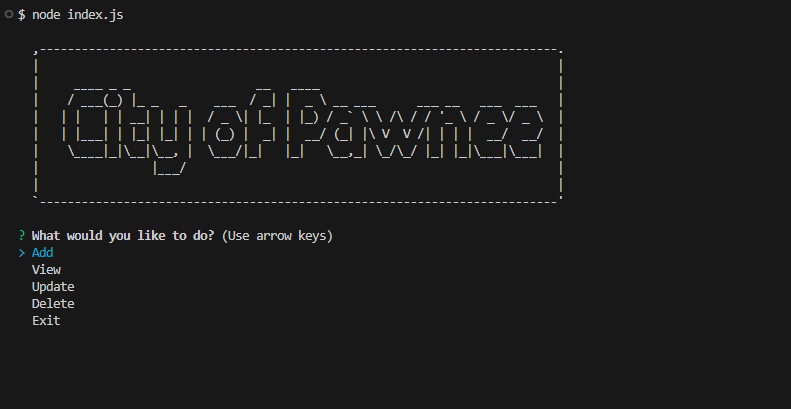
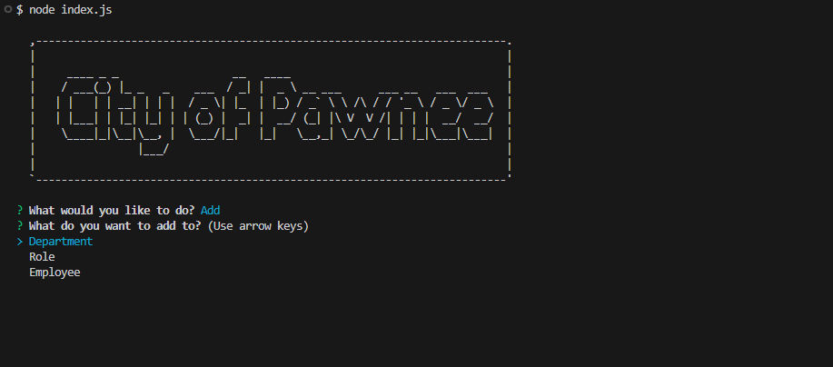

# Royce-s_Employee_Tracker
An application to keep track of all employee information.

## Description

Provide a short description explaining the what, why, and how of your project. Use the following questions as a guide:

- Wanting to design an app that is capable of keeping track of employee's their roles, and departments.
- This makes it very easy to control a database of employees

## Table of Contents (Optional)

If your README is long, add a table of contents to make it easy for users to find what they need.

- [Installation](#installation)
- [Usage](#usage)
- [Credits](#credits)
- [License](#license)

## Installation

Run "npm i"
enter "psql -U postgres"
enter your password "root"
run \i db/schema.sql
run \i db/seed.sql

switch to bash
run "node index.js"

## Usage

   

    

## Credits

I had a lot of help from my classmates and TAs in order to complete this app. I have to appreciate them for guiding me and giving me assistance on testing and fixing my code.

## License

MIT License

Copyright (c) 2024 Wartech93

Permission is hereby granted, free of charge, to any person obtaining a copy
of this software and associated documentation files (the "Software"), to deal
in the Software without restriction, including without limitation the rights
to use, copy, modify, merge, publish, distribute, sublicense, and/or sell
copies of the Software, and to permit persons to whom the Software is
furnished to do so, subject to the following conditions:

The above copyright notice and this permission notice shall be included in all
copies or substantial portions of the Software.

THE SOFTWARE IS PROVIDED "AS IS", WITHOUT WARRANTY OF ANY KIND, EXPRESS OR
IMPLIED, INCLUDING BUT NOT LIMITED TO THE WARRANTIES OF MERCHANTABILITY,
FITNESS FOR A PARTICULAR PURPOSE AND NONINFRINGEMENT. IN NO EVENT SHALL THE
AUTHORS OR COPYRIGHT HOLDERS BE LIABLE FOR ANY CLAIM, DAMAGES OR OTHER
LIABILITY, WHETHER IN AN ACTION OF CONTRACT, TORT OR OTHERWISE, ARISING FROM,
OUT OF OR IN CONNECTION WITH THE SOFTWARE OR THE USE OR OTHER DEALINGS IN THE
SOFTWARE.

🏆 The previous sections are the bare minimum, and your project will ultimately determine the content of this document. You might also want to consider adding the following sections.

## Features

- Ability to add, view, update, and delete any employees
- Ability to add employees, roles, and departments
- Ability to update employees role, roles and departments
- Ability to view each section
- Ability to delete employees, roles and departments.

## Tests

Went over multiple tests getting every prompt to work. Tested making sure each function was capable of adding, viewing, deleting or updating successfully. Made sure the database was capable of recieving data.